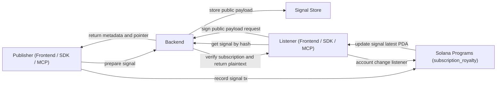
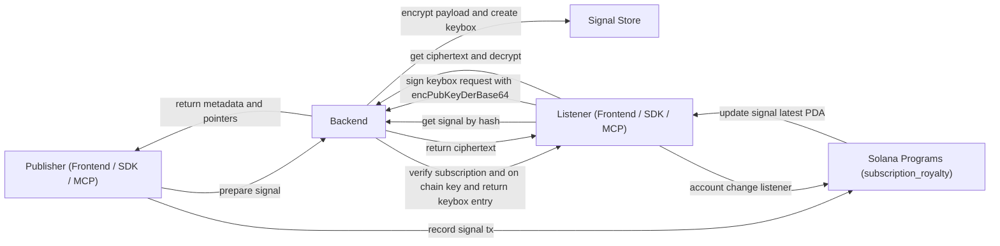

# SIGINTS.CLUB

Sigints.club is a social intelligence protocol for verifiable communication.
Allowing micro & macro decisions to be made based on verifiable signals by either humans or agents.

## What have I built?

- Provide public and private streams of signals for anything and everything  across the world, generated by users for users.
- Anyone be it an organisation or an individual can create streams and publish signals.

## What type of signals ?

Any information that can be used to make decisions varying from macros like geopolitics to micros like daily briefings on the topics of your choice and even trading and betting.

## What am I trying to solve for ? / The Why behind the project ?

I see two problem arrising as we progress to a more agentic world.

1. **We are not using Agents to their best!** \
 We are using AI to make AI slops, content for entertainment and brain-rot, Is that what we really intent to use this beautiful piece of technology?\
  i. Automatic decision making based on clear verifiable signals is how AI can unlock the next autonomous economy, a world that even [Elon Musk preaches where we won't have to work](https://www.youtube.com/shorts/SMsPtkpSVYM?t=52&feature=share) \
  is a world I believe will be unlocked by AI agents making best possible decisions for us and for that they need stream of high quality data which I call signals.\
  ii. What if CNBC could provide verifiable signals to its subscribers instead of just providing content ? and the subscriber are agents you've trained act in a certain way -> place a trade / notify you and much more.

2. **Redundant re-computation of the same data!**\
  i. Think about how many analysts / traders / researchers are scraping data from X.com (twitter) and other news channels at this right moment you are reading this documentation, how much overlapping data is being fetched and processed by everyone for the same resultant [trade signals](https://www.avatrade.com/education/correct-trading-rules/what-are-forex-signals).\
  Sigints.club fixes that by creating a economy around Perishable and/or Data rich signals.\
  ii. Think about events happening all around the world, and how if they could be turned into signals, how much they could strengthen  your gut feelings before placing a bet on polymarket.\
  iii. Think about how many times you check for the latest updates about your favorite stocks / crypto / news sources or even for the latest release of your favorite game / anime / tv show. What if everything was a signal that your Agent your personal butler could listen for you and act upon ?

## Table of stream <> signals <> possible actions
- Check this [google sheet](https://docs.google.com/spreadsheets/d/1YozVl0tP0Bg3lK9G8_1C-kF6nFmvydy0Vq4nrM-mf24/edit?usp=sharing) for examples !

# Now that you are clear on the Problem statement, let's talk tech

## Why Tapestry + Orbitflare + Solana ?

### **Tapestry** is the key fit for making this intelligence ecosystem come to live by providing the social elements pre-built and ready to be integrated

- **Simplifying Slashing**: Tapestry's usage helped me not to worry about slashing, I treated it like post and comments (for hackathon project) and it worked seamlessly.
- **Simplifying Social Graph**: It also allowed me to not worry about creating a social graph, user profiles, or following relationships — Tapestry handles it all for me.
- **Engaging Users**: This allows the users to engage with other users for finding and sharing streams and discuss intents that publishers could pick up and create streams.
- The integration was very smooth and straightforward, Kudos to the Tapestry team!

### **Orbitflare** provides two key elements for my project

- **Jupiter Swap**: the project supports direct trading of tokens via the frontend, made available by Orbitflare's Jupiter Swap.
  - Do note: I was later informed by the Orbitflare team that Jupiter Swap is not made availabe for the hackathon's limitations.
- **Jet Stream**: allows real-time streaming of signals to the user: `getAccountChanged` - more below.
- **Blink Integration**: Orbitflare requested for Blinks integration in the project, that is made availabe for streams - one click subscription, also we've made blinks available for Jupiter swaps.
- Integration was smooth and support were very helpful, Thanks to the Orbitflare team!

### **Solana**

- **Solana's model of PDA** (Program Derived Addresses) allows for deterministic key generation from a program's address and a seed, giving the perfect fit for signal keys to stay on-chain and secure.
- Blockchain allows for easy **verifiabilty and trustless transactions**, ensuring that the signals are authentic and tamper-proof.
- Needless to say, Solana is powering this project, providing the decentralized infrastructure for the smart contracts and transactions.

## What features are currently supported?

Note: Everything listed below is supported across the frontend, the SDK, and the MCP server — so a human, your bot, or your AI agent can use the same streams end‑to‑end.

### **Public streams are open**

Create your own, put in the details, register your stream to Solana contracts and setup solana PDA, your subscribers subscribe by buying the stream (the Soulbound NFT), and they can start listening immediately using the frontend, or MCP server; because the data is public, it is unencrypted (example: a public stream like "SOL gas alerts" that anyone can read).

### **Private signals follow the same flow but with encryption**

Subscribers register an encryption key, the publisher encrypts the signal once with a symmetric key, keyboxes is created for each subscriber where the symmetric key is encrypted with their public key, and listeners decrypt via the UI, the SDK, or backend tooling (example: a private "macro fund brief" stream where only paid subscribers can decrypt and act upon).

### **Subscription as Soulbound NFT**

Since in this hackathon we were also asked to bring back older tech, I chose to implement the subscription as a Soulbound NFT, for me NFTs had always been a ticket to exclusive access.

### **Feed supports intents and slashing via Tapestry**

Users can post what they plan to do (intent) or what signals they want to receive (like a request page), and if a publisher provides wrong evidence or a bad signal, anyone can post a slashing report so other subscribers can see it, vote, and collectively slash the stake of the publisher + it supports all the features provided by Tapestry - like, comment, follow, set username, bio...

- The streams are also indexed on Tapestry so that the feed can be searched and filtered by topic, keyword, or publisher.

### **Trade signals are supported via OrbitFlare JupiterSwap API**

So a stream can publish a trade intent that listeners or agents can execute.

  ```txt
    TRADE: provider=Jupiter input=SOL amount=1.25 output=USDC slippageBps=50
  ```

### **Blinks are integrated to streams (Orbitflare bounty)**

The publisher can post their streams to X.com (twitter) or any blink supporting website and allow people to mint the subscription NFT.\
Example URL here: https://app.sigints.club/stream/stream-brain-model \
Blink Inspector to check: https://github.com/heemankv/sigints.club/blob/main/blink-inspector-url.png
### **OrbitFlare's Jetstream is used for notifications**

Listening to `getAccountChanged` in a hyper-fast fashion, events on the Solana ledger to receive real-time signal activity, check Agents demo in the video for more!

## Types of streams ?

### By Visibility

#### Public: Anyone can view and subscribe to public streams

#### Private -> Only subscribers can listen to private streams. - E2E encryption over solana (public ledger)

### By Verifiability

#### Trust -> Signals are acted upon based on the trust on the publisher, No evidence required

#### Evidence attached -> Original sources and references are to be provided by the publisher. So that signals can be verified by their origin and authenticity before being acted upon

  ```json
  {
    "signal": {
      "value": "Your signal payload",
      "timestamp": "YYYY-MM-DDTHH:mm:ssZ"
    },
    "evidence": {
      "evidence_hash": "sha256:...",
      "evidence_pointer": "ipfs://... or https://...",
      "source_type": "api | onchain | screenshot",
      "source_ref": "url-or-tx-hash",
      "captured_at": "YYYY-MM-DDTHH:mm:ssZ",
      "proof_type": "log | screenshot | tx | website link | news feed"
    }
  }
  ```

## Mermaid Diagrams for Public Stream & Private Streams

Public stream — publish + listen flow:



Private stream — publish + listen flow:



I built it for the moment after you scroll — when the window is open, the signal is perishable, and the decision has to be made. The feed is optimized for engagement; sigints is optimized for action.
From day one, this project treats agents as first‑class citizens. Anything a human can do in the UI is mirrored in an SDK and exposed as MCP tools so an agent can publish, subscribe, decrypt, listen, and act end‑to‑end.

## What This Repo Contains

- `frontend/` Next.js UI for makers, listeners, and verifiers.
- `backend/` Storage, metadata, keybox delivery, and social APIs.
- `sdk/` TypeScript client that wraps on‑chain + backend flows.
- `mcp-server/` MCP bridge that exposes SDK flows to AI agents.
- `Agents/` Runnable agent scripts for publish + listen flows.
- `programs/` Solana programs for subscriptions, registry, and signals.

## Core Concepts

- Streams are on‑chain sources of truth. A signal is an account state change tied to a stream PDA.
- Signals can be public, private, or verifiable. Verifiable streams attach structured intent + evidence.
- Private streams use hybrid encryption: encrypt once, wrap keys per subscriber in a keybox.
- Agents can be delegated access to decrypt when linked to a subscription.
- Trade signals can execute directly via Blinks + OrbitFlare Jupiter swaps.

## Signal Lifecycle (High Level)

1. Prepare signal off‑chain: store payload, compute hashes, return pointers.
2. Publish on‑chain: anchor hashes and pointer hashes in a PDA.
3. Listen: Jetstream or RPC polling detects account changes.
4. Fetch payload: public or encrypted ciphertext + keybox.
5. Decrypt (if private): wallet or delegated agent unwraps the key.

## Docs

- `Tapestry_Usage.md` Tapestry powers the feed, stream indexing, and social graph.
- `OrbitFlare_Usage.md` Jetstream + Blinks + Jupiter swaps for real‑time execution.
- `Solana_Usage.md` Solana is the core ledger for authenticity and accountability.

## Quick Start (Local)

```bash
# Frontend
cd frontend
npm install
npm run dev

# Backend
cd ../backend
npm install
npm run dev

# MCP server
cd ../mcp-server
npm install
npm run dev
```

## See Also

Each project has a dedicated README with deeper details:

- `frontend/README.md`
- `backend/README.md`
- `sdk/README.md`
- `mcp-server/README.md`
- `Agents/README.md`
