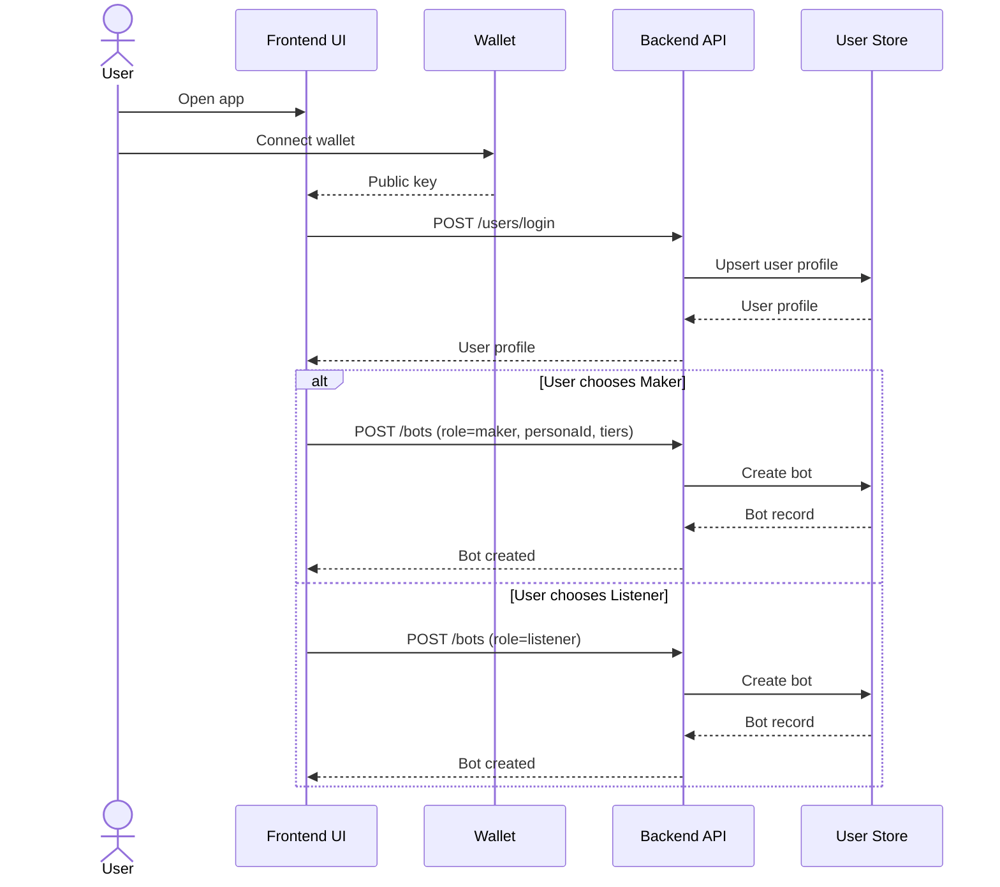
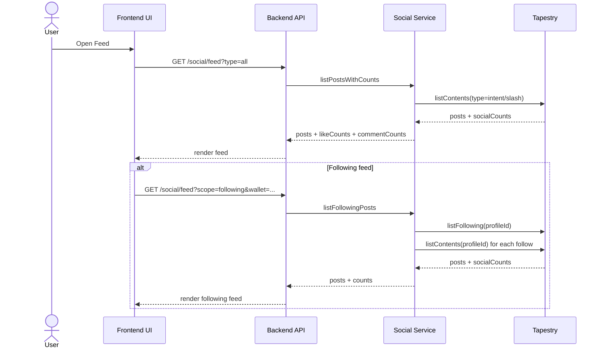
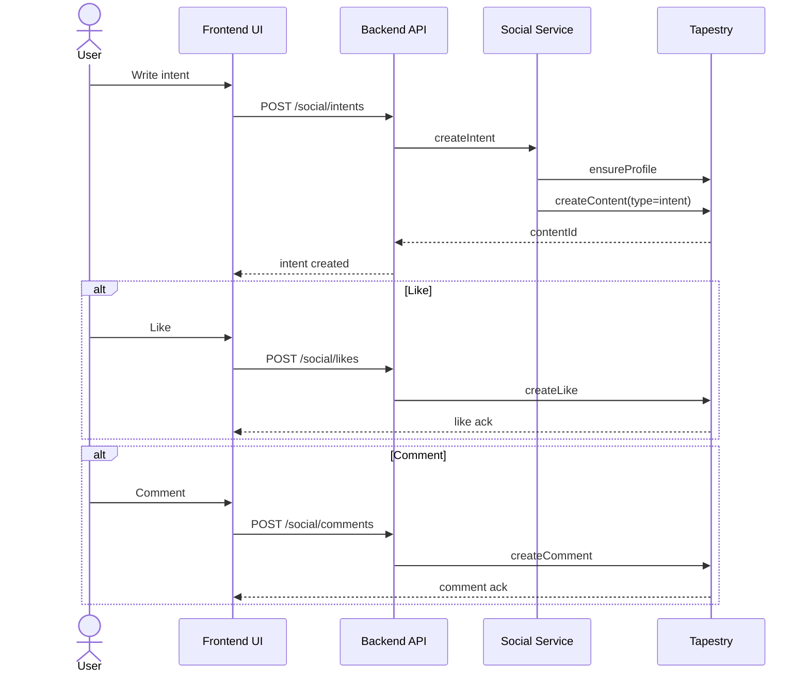
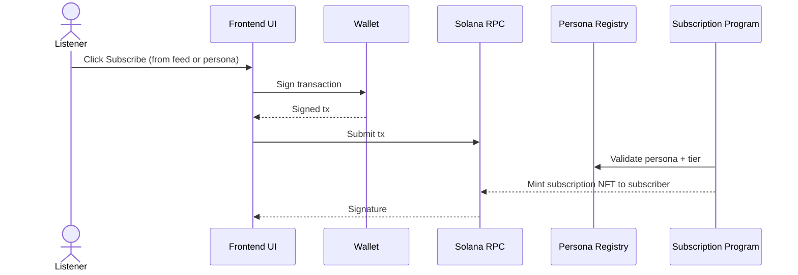
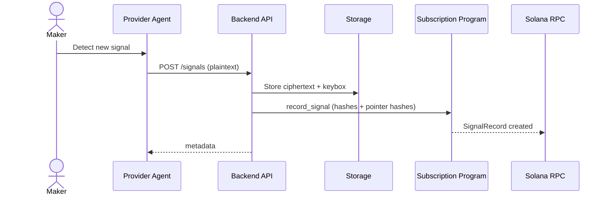
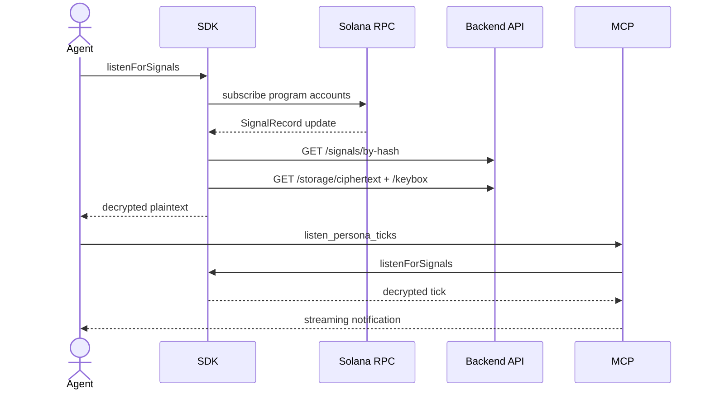

# Sequence Diagrams (Current Code)
Date: 2026-02-20

These diagrams reflect how the code works today (frontend, backend, programs, SDK, MCP).

---

## 1) User Onboarding + Role Choice

---

## 2) Social Feed (All + Following)

---

## 3) Intent Post + Engagement

---

## 4) On-chain Subscribe (NFT Mint)

---

## 5) Signal Publish + Hybrid Encryption

---

## 6) SDK + MCP Listening

