# Sequence Diagrams (Current Code)
Date: 2026-02-15

These diagrams reflect how the code works today (frontend, backend, programs, SDK, MCP). Optional branches are shown with `alt` blocks.

**1) User Onboarding + Role Choice**
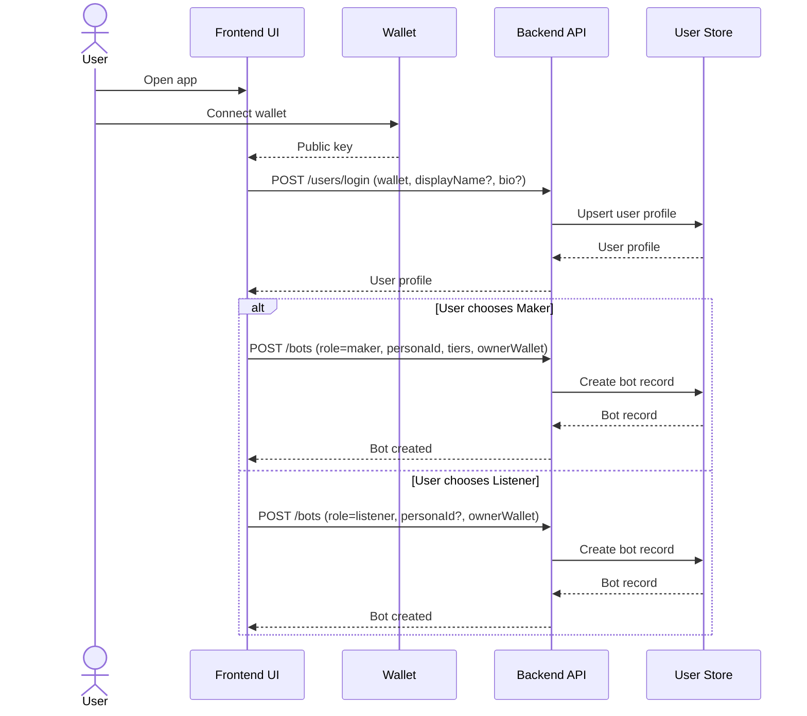

**2) Maker Persona Registration (On-chain Registry)**
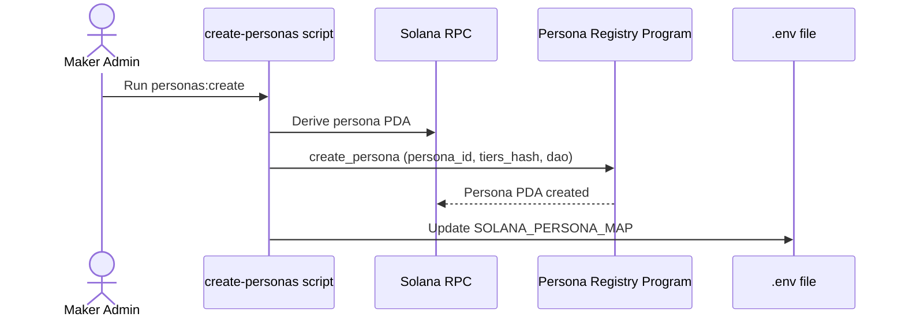

**3) Maker Bot Registration + Optional Social Profile**
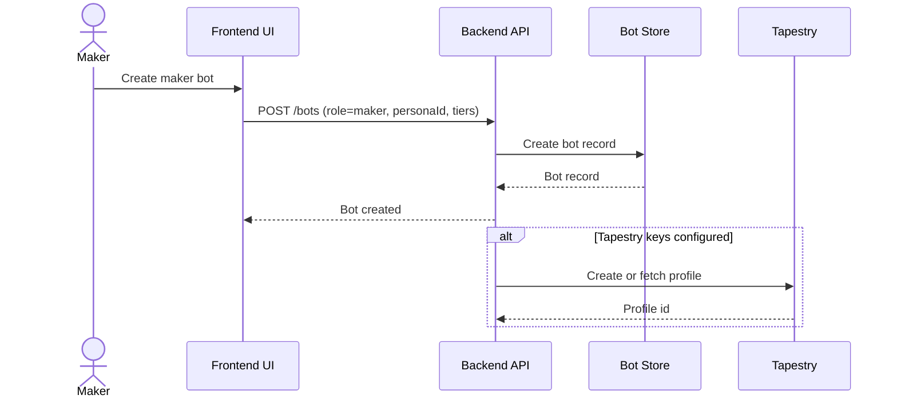

**4) Discovery + Feed**
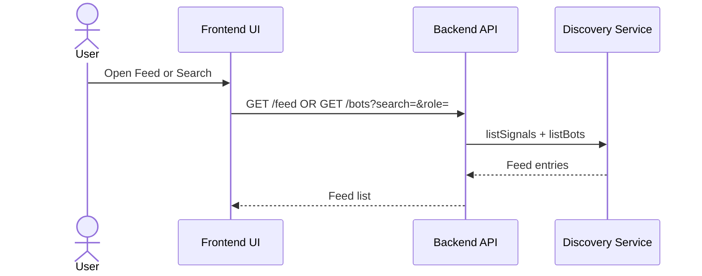

**4B) Social Intent Post**
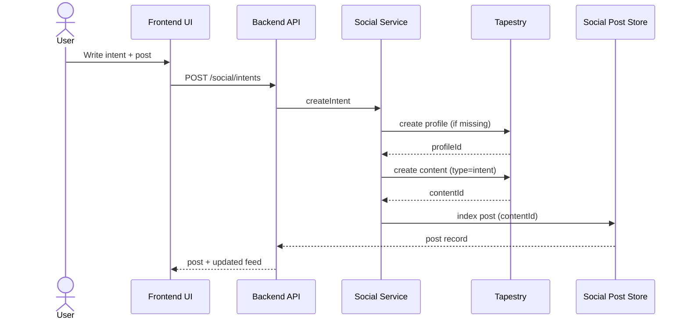

**4C) Slash Report + Votes + Comments**
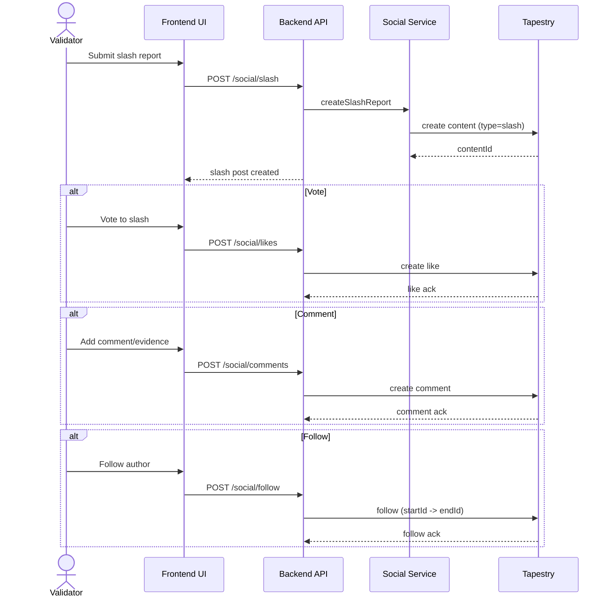

**4D) Trending Feed**
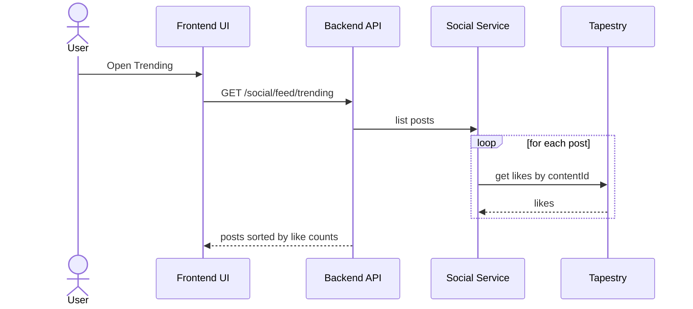

**4E) Follow Maker From Persona Page**
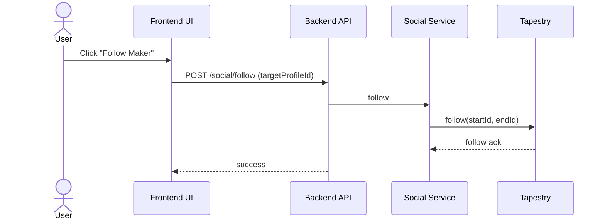

**5) Key Generation + Off-chain Subscribe (Encryption Key)**
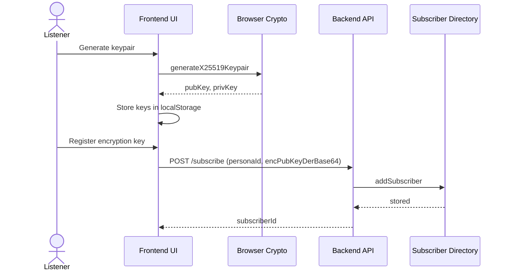

**6) On-chain Subscribe (NFT Mint + Persona Enforcement)**
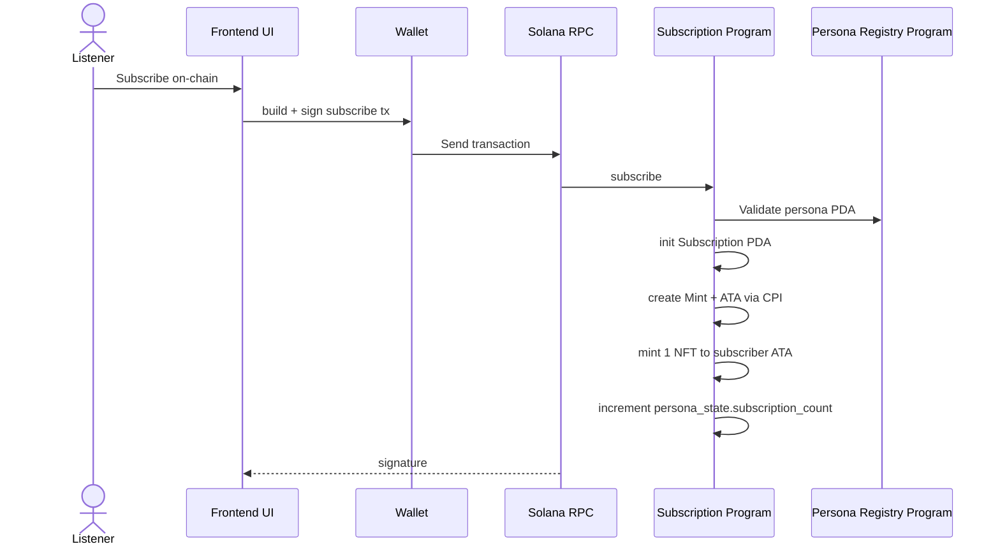

**7) Maker Publish Signal (Event Loop)**
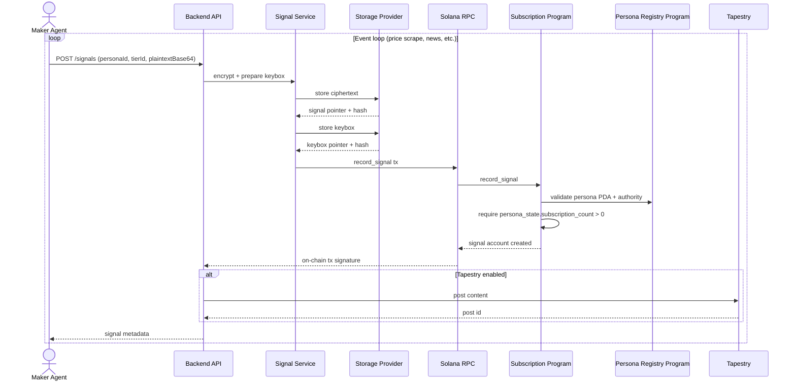

**8) Listener Agent via SDK (On-chain Stream + Decrypt)**
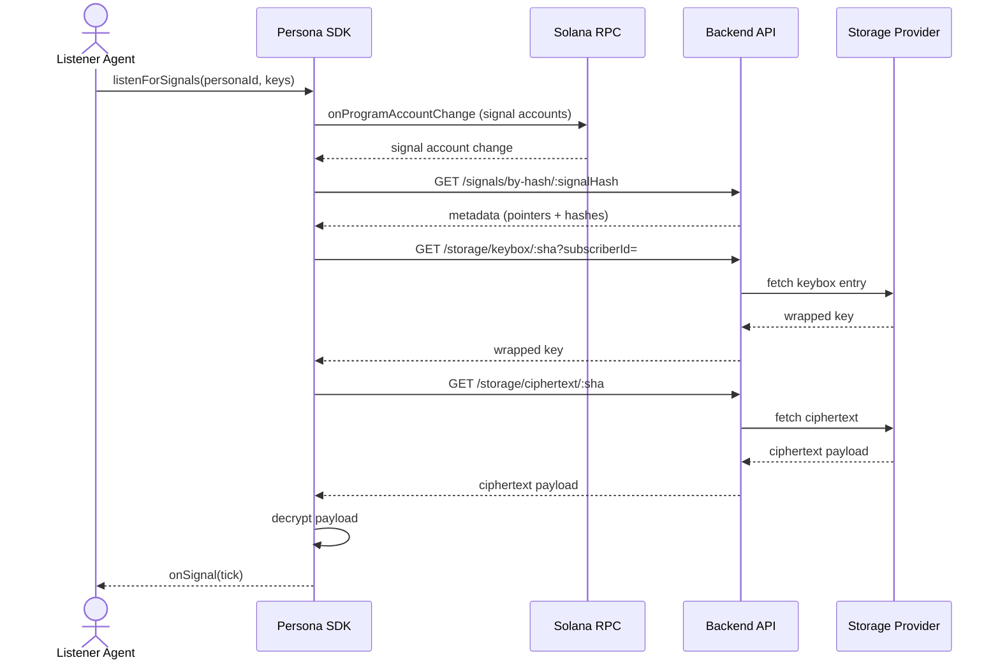

**9) Listener via MCP Server (Long-running Listen Mode)**
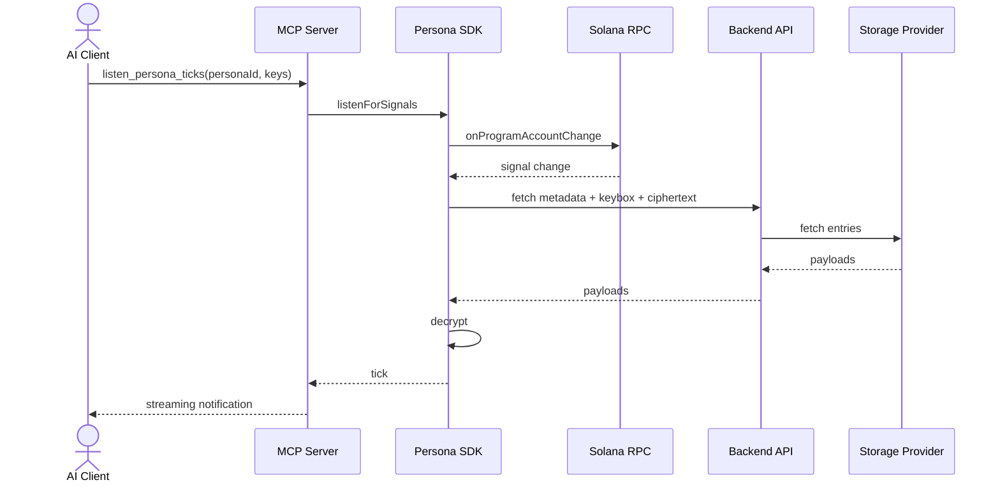

**10) Frontend Decrypt (Manual)**
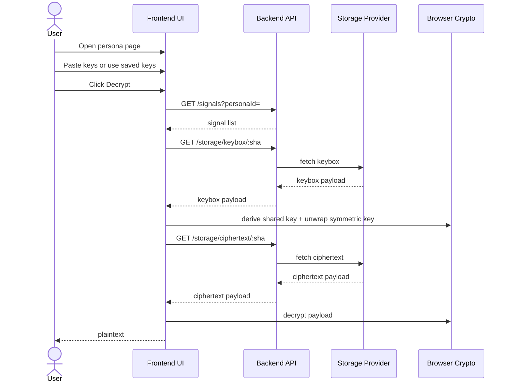

**11) On-chain Renew + Cancel**
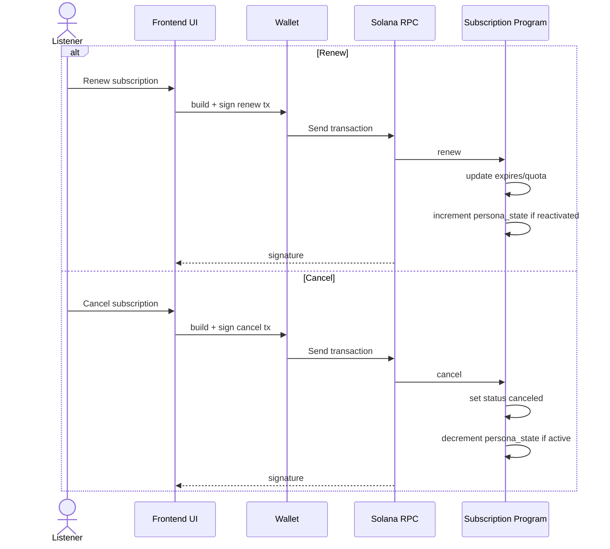

**12) Backend Listener Script (Non-SDK)**
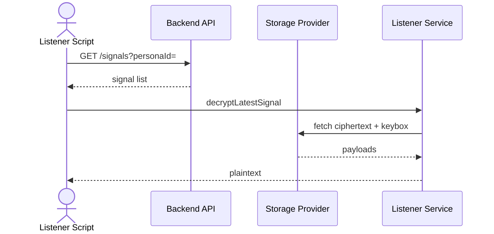

**13) Provider Script (Non-UI Maker Agent)**
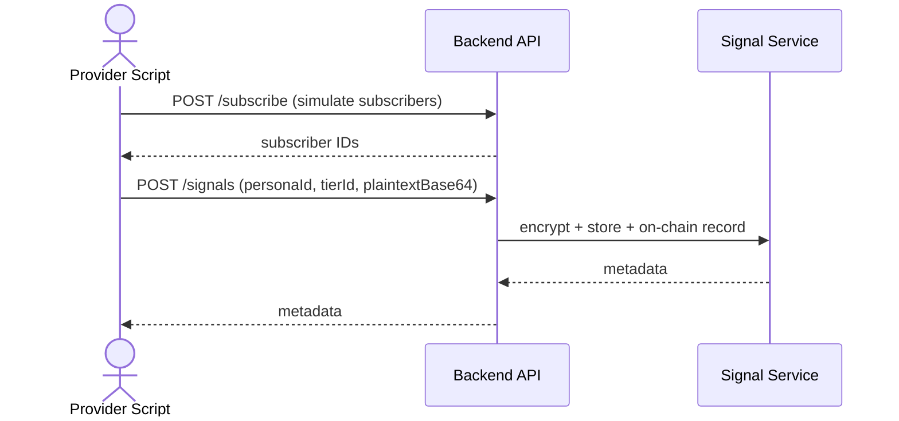

If you want these reorganized into “MVP only” vs “Future/Tapestry-enabled,” tell me and I’ll split the document.
